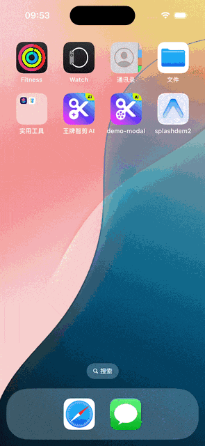
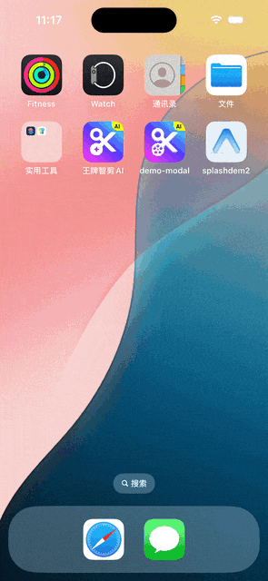

# expo-splash-screen2

`expo-splash-screen2` 允许您通过多种显示模式自定义应用的启动屏幕，包括 WebView HTML、响应式背景图片和固定宽度的居中图片。它支持深色模式，并提供无缝的过渡体验。

> [English](./README.md) | **中文文档**

- [⚡ 快速开始](#-快速开始)
- [🚀 功能特性](#-功能特性)
- [📚 API](#-api)
- [🗒 示例](#-示例)
- [💻 安装](#-安装)
  - [在托管 Expo 项目中安装](#-在托管-expo-项目中安装)
  - [在裸 React Native 项目中安装](#-在裸-react-native-项目中安装)
- [⚙️ 配置](#️-配置)
  - [WebView 模式](#webview-模式)
  - [ResponsiveImage 模式](#responsiveimage-模式)
  - [Normal 模式](#normal-模式)
  - [Blend 模式](#blend-模式)
  - [深色模式支持](#深色模式支持)
- [📱 平台特定详情](#-平台特定详情)
  - [iOS 配置](#-ios-配置)
  - [Android 配置](#-android-配置)
- [👏 贡献](#-贡献)
- [❓ 已知问题](#-已知问题)
- [📄 许可证](#-许可证)
- [🏅 致谢](#-致谢)

## ⚡ 快速开始

使用 WebView 模式快速开始使用 `expo-splash-screen2`。

### 步骤 1: 安装包

```bash
# 如果已安装 expo-splash-screen，请先卸载（它们互斥）
npm uninstall expo-splash-screen

# 安装 expo-splash-screen2
npm install expo-splash-screen2
# 或
pnpm add expo-splash-screen2
# 或
yarn add expo-splash-screen2
```

> **注意**：如果您使用 `pnpm` 并看到关于忽略构建脚本的警告，请运行 `pnpm approve-builds` 以允许包执行其 postinstall 脚本。

### 步骤 2: 配置 app.json

在您的 `app.json` 或 `app.config.js` 中添加插件，使用 WebView 模式：

```json
{
  "expo": {
    "plugins": [
      [
        "expo-splash-screen2",
        {
          "mode": "webview",
          "backgroundColor": "#FFFFFF"
        }
      ]
    ]
  }
}
```

### 步骤 3: 运行 Prebuild

安装后，运行 prebuild 以应用原生修改：

```bash
npx expo prebuild
```

### 步骤 4: 在应用中使用

在您的主组件中（例如 `App.tsx`），阻止启动屏幕自动隐藏并控制何时隐藏它：

```tsx
import React, { useEffect, useState } from 'react';
import { View, Text } from 'react-native';
import * as SplashScreen from 'expo-splash-screen2';

// 在 App 组件声明之前阻止原生启动屏幕自动隐藏
SplashScreen.preventAutoHideAsync();

export default function App() {
  const [appIsReady, setAppIsReady] = useState(false);

  useEffect(() => {
    async function prepare() {
      try {
        // 预加载字体、进行 API 调用等
        await loadFonts();
        await loadInitialData();
      } catch (e) {
        console.warn(e);
      } finally {
        setAppIsReady(true);
        await SplashScreen.hideAsync();
      }
    }

    prepare();
  }, []);

  if (!appIsReady) {
    return null;
  }

  return (
    <View style={{ flex: 1, alignItems: 'center', justifyContent: 'center' }}>
      <Text>您的应用内容</Text>
    </View>
  );
}
```

### 步骤 5: 自定义启动屏幕 HTML

插件会自动将 `expo-splash-web` 文件夹复制到您的项目根目录。您可以通过编辑 `expo-splash-web/src/` 中的文件来自定义 HTML 启动屏幕：

```bash
# 构建启动屏幕 Web 资源
npm run build:expo-splash-web

# 或在开发模式下运行（支持热重载）
npm run dev:expo-splash-web
```

进行更改后，重新构建并再次运行 prebuild：

```bash
npm run build:expo-splash-web
npx expo prebuild
```

### 完成！🎉

您的应用现在拥有了一个基于 WebView 的自定义启动屏幕。有关更高级的配置和其他显示模式，请参阅下面的[配置](#️-配置)部分。

## 🚀 功能特性

### 显示模式

`expo-splash-screen2` 提供四种启动屏幕模式以适应不同的使用场景：

#### `webview` 模式

在 WebView 中显示 HTML 内容，允许复杂的动画和交互式启动屏幕。

- 完整的 JavaScript/CSS 支持
- React 组件支持（使用 esbuild 打包器）
- 非常适合动画启动屏幕
- JavaScript 桥接用于原生通信

#### `responsiveImage` 模式

显示全屏背景图片，缩放以覆盖整个屏幕。

- 在 Android 上支持 `.9.png`（九宫格）格式
- `scaleAspectFill` 内容模式
- 最适合照片或详细背景

#### `normal` 模式

显示固定宽度（默认 100px）的居中图片，保持宽高比。

- 固定宽度，自动高度
- 在屏幕上居中显示，带背景颜色
- **支持深色模式**，具有独立的图片和背景颜色
- 最适合以 Logo 为中心的启动屏幕

#### `blend` 模式

结合 `.9.png` 背景图片和 WebView HTML 内容，增强开屏体验。

- 使用 `.9.png` 图片作为系统启动屏幕背景
- WebView 容器使用透明背景（推荐），实现无缝过渡
- WebView 覆盖层支持完整的 HTML/JavaScript/CSS
- 完美实现从系统启动屏幕到自定义动画启动屏幕的平滑过渡
- 最适合需要原生性能和丰富动画的应用

### 深色模式支持（Normal 模式）

`expo-splash-screen2` 支持根据系统外观变化而响应的启动屏幕，适用于 iOS 13+ 和 Android 10+。

<table>
  <thead><tr><td>浅色模式</td><td>深色模式</td></tr></thead>
  <tbody><tr>
    <td>背景：自定义颜色<br>图片：浅色模式图片</td>
    <td>背景：自定义深色<br>图片：深色模式图片</td>
  </tr></tbody>
</table>

### 跨平台支持

- **Android**：完全支持 Android 12+ 系统启动屏幕、自定义活动和无缝过渡
- **iOS**：原生 UIView 集成、storyboard 支持和流畅动画

### StatusBar 自定义

`expo-splash-screen2` 允许根据 [React Native StatusBar API](https://reactnative.dev/docs/statusbar) 自定义 StatusBar。您可以在启动屏幕显示期间控制 StatusBar 的可见性、样式和背景颜色。

## 📚 API

```tsx
import * as SplashScreen from 'expo-splash-screen2';
```

通过此模块控制的原生启动屏幕会在 React Native 控制的视图层次结构挂载后自动隐藏。这意味着当您的应用首次 `render` 视图组件时，原生启动屏幕将隐藏。可以通过调用 [`SplashScreen.preventAutoHideAsync()`](#splashscreenpreventautohideasync) 来阻止此默认行为，然后稍后调用 [`SplashScreen.hideAsync()`](#splashscreenhideasync)。

### `SplashScreen.preventAutoHideAsync()`

此方法使原生启动屏幕保持可见，直到调用 [`SplashScreen.hideAsync()`](#splashscreenhideasync)。这必须在渲染任何 React Native 控制的视图层次结构之前调用（在您的主组件的全局作用域中，或者在组件开始时渲染 `null` - 请参阅[示例部分](#-示例)）。

如果您的应用程序需要在首次渲染实际视图层次结构之前准备/下载某些资源和/或进行一些 API 调用，阻止默认自动隐藏可能会很有用。

> **重要**：建议在全局作用域中调用此方法而不等待，而不是在 React 组件或钩子内部调用。

#### 返回值

一个 `Promise`，当成功阻止自动隐藏时解析为 `true`，如果原生启动屏幕已经被阻止自动隐藏（例如，如果您已经调用过此方法），则解析为 `false`。`Promise` 拒绝很可能意味着无法阻止原生启动屏幕自动隐藏（执行此方法时它已经隐藏）。

### `SplashScreen.hideAsync()`

隐藏原生启动屏幕。仅当通过调用 [`SplashScreen.preventAutoHideAsync()`](#splashscreenpreventautohideasync) 方法先前阻止了原生启动屏幕自动隐藏时才有效。

#### 返回值

一个 `Promise`，一旦启动屏幕隐藏就解析为 `true`，如果启动屏幕已经隐藏则解析为 `false`。

## 🗒 示例

### 在全局作用域中调用 `SplashScreen.preventAutoHideAsync()`

`App.tsx`

```tsx
import React from 'react';
import { StyleSheet, Text, View } from 'react-native';
import * as SplashScreen from 'expo-splash-screen2';

// 在 App 组件声明之前阻止原生启动屏幕自动隐藏
SplashScreen.preventAutoHideAsync()
  .then((result) => console.log(`SplashScreen.preventAutoHideAsync() succeeded: ${result}`))
  .catch(console.warn); // 最好显式捕获并检查任何错误

export default class App extends React.Component {
  componentDidMount() {
    // 2 秒后隐藏原生启动屏幕
    setTimeout(async () => {
      await SplashScreen.hideAsync();
    }, 2000);
  }

  render() {
    return (
      <View style={styles.container}>
        <Text style={styles.text}>SplashScreen Demo! 👋</Text>
      </View>
    );
  }
}

const styles = StyleSheet.create({
  container: {
    flex: 1,
    alignItems: 'center',
    justifyContent: 'center',
    backgroundColor: '#aabbcc',
  },
  text: {
    color: 'white',
    fontWeight: 'bold',
  },
});
```

### 基本用法

```tsx
import * as SplashScreen from 'expo-splash-screen2';

// 在 App 组件声明之前阻止原生启动屏幕自动隐藏
SplashScreen.preventAutoHideAsync();

export default function App() {
  const [appIsReady, setAppIsReady] = useState(false);

  useEffect(() => {
    async function prepare() {
      try {
        // 预加载字体、进行 API 调用等
        await loadFonts();
        await loadInitialData();
      } catch (e) {
        console.warn(e);
      } finally {
        setAppIsReady(true);
        await SplashScreen.hideAsync();
      }
    }

    prepare();
  }, []);

  if (!appIsReady) {
    return null;
  }

  return (
    <View style={styles.container}>
      <Text>您的应用内容</Text>
    </View>
  );
}
```

### 使用 Expo Router

```tsx
// app/_layout.tsx
import * as SplashScreen from 'expo-splash-screen2';
import { useEffect } from 'react';

SplashScreen.preventAutoHideAsync();

export default function RootLayout() {
  useEffect(() => {
    // 初始渲染后隐藏启动屏幕
    SplashScreen.hideAsync();
  }, []);

  return (
    <Stack>
      <Stack.Screen name="(tabs)" options={{ headerShown: false }} />
    </Stack>
  );
}
```

### 演示

查看启动屏幕模式的实际效果：

#### `webview` 模式

在 WebView 中显示 HTML 内容，支持完整的 JavaScript/CSS。

<table>
  <thead><tr><td>Android</td><td>iOS</td></tr></thead>
  <tbody><tr>
<td>


</td>
<td>



</td>
    </tr>
  </tbody>
</table>

#### `responsiveImage` 模式

显示全屏背景图片，缩放以覆盖整个屏幕。

<table>
  <thead><tr><td>Android</td><td>iOS</td></tr></thead>
  <tbody><tr>
<td>


</td>
<td>



</td>
    </tr>
  </tbody>
</table>

#### `normal` 模式

显示固定宽度的居中图片，保持宽高比。支持深色模式。

<table>
  <thead><tr><td>Android</td><td>iOS</td></tr></thead>
  <tbody><tr>
<td>


</td>
<td>


</td>
    </tr>
  </tbody>
</table>

#### `blend` 模式

结合 `.9.png` 背景图片和 WebView HTML 内容，增强开屏体验。系统启动屏幕使用 `.9.png` 图片作为背景，WebView 容器使用透明背景（推荐），实现无缝过渡。

**注意**：Blend 模式结合了 `responsiveImage` 模式的视觉效果（`.9.png` 背景）和 `webview` 模式的功能（HTML 内容覆盖层）。这实现了从系统启动屏幕到自定义动画启动屏幕的平滑过渡。

## 💻 安装

### 在托管 Expo 项目中安装

对于托管 Expo 项目，请按照标准安装流程：

```bash
# 如果已安装 expo-splash-screen，请先卸载（它们互斥）
npm uninstall expo-splash-screen

# 安装 expo-splash-screen2
npm install expo-splash-screen2
# 或
pnpm add expo-splash-screen2
# 或
yarn add expo-splash-screen2
```

> **注意**：`expo-splash-screen` 和 `expo-splash-screen2` 互斥。您只能在项目中使用其中一个。

### 在裸 React Native 项目中安装

对于裸 React Native 项目，您必须确保在继续之前已[安装并配置了 `expo` 包](https://docs.expo.dev/bare/installing-expo-modules/)。

#### 将包添加到依赖项

```bash
npm install expo-splash-screen2
# 或
pnpm add expo-splash-screen2
# 或
yarn add expo-splash-screen2
```

#### iOS 设置

安装包后运行 `npx pod-install`：

```bash
npx pod-install
```

#### Android 设置

无需额外设置。插件将在 prebuild 期间自动配置 Android。

### pnpm 构建脚本批准

如果您使用 `pnpm` 并遇到关于忽略构建脚本的警告：

```
╭ Warning ────────────────────────────────────────────────────────────────────────╮
│                                                                                 │
│   Ignored build scripts: expo-splash-screen2, unrs-resolver.           │
│   Run "pnpm approve-builds" to pick which dependencies should be allowed to     │
│   run scripts.                                                                  │
```

按照提示运行 `pnpm approve-builds` 以允许 `expo-splash-screen2` 执行其 postinstall 脚本：

```bash
pnpm approve-builds
```

这将允许包运行其 postinstall 脚本，这对于正确设置是必要的。

### 安装后设置

安装后，插件将自动：
1. 将 `expo-splash-web` 文件夹复制到您的项目根目录
2. 将构建命令添加到您的 `package.json`
3. 使用插件配置更新您的 `app.json`
4. 从 `package.json` 中删除 `expo-splash-screen` 依赖

**如果您使用 pnpm 且 postinstall 脚本未自动运行**，您可以手动运行设置脚本：

```bash
# 从项目根目录
node node_modules/expo-splash-screen2/scripts/setup.js
```

安装（或手动设置）后，运行 prebuild 以应用原生修改：

```bash
npx expo prebuild
```

## ⚙️ 配置

将插件添加到您的 `app.json` 或 `app.config.js`：

### WebView 模式

显示 HTML 内容，支持完整的 JavaScript/CSS：

```json
{
  "expo": {
    "plugins": [
      [
        "expo-splash-screen2",
        {
          "mode": "webview",
          "backgroundColor": "#FFFFFF"
        }
      ]
    ]
  }
}
```

> **注意**：对于 `webview` 和 `blend` 模式，必须安装 `react-native-web` 来打包 web 文件：
> ```bash
> npm install react-native-web
> # 或
> pnpm add react-native-web
> # 或
> yarn add react-native-web
> ```

#### WebView 模式选项

| 选项 | 类型 | 必需 | 描述 |
|--------|------|----------|-------------|
| `mode` | `"webview"` | 是 | 启用 WebView HTML 模式 |
| `backgroundColor` | `string` | 否 | 背景颜色（默认：`#ffffff`） |
| `localHtmlPath` | `string` | 否 | 自定义 HTML 文件的路径 |

### ResponsiveImage 模式

显示全屏背景图片：

```json
{
  "expo": {
    "plugins": [
      [
        "expo-splash-screen2",
        {
          "mode": "responsiveImage",
          "backgroundColor": "#FFFFFF",
          "image": "./assets/splash-background.png"
        }
      ]
    ]
  }
}
```

#### ResponsiveImage 模式选项

| 选项 | 类型 | 必需 | 描述 |
|--------|------|----------|-------------|
| `mode` | `"responsiveImage"` | 是 | 启用响应式图片模式 |
| `backgroundColor` | `string` | 否 | 背景颜色（默认：`#ffffff`） |
| `image` | `string` | 是 | 背景图片路径（支持 `.9.png`） |

### Normal 模式

显示固定宽度的居中图片：

```json
{
  "expo": {
    "plugins": [
      [
        "expo-splash-screen2",
        {
          "mode": "normal",
          "backgroundColor": "#10021F",
          "image": "./assets/splash-icon.png",
          "imageWidth": 100
        }
      ]
    ]
  }
}
```

#### Normal 模式选项

| 选项 | 类型 | 必需 | 描述 |
|--------|------|----------|-------------|
| `mode` | `"normal"` | 是 | 启用普通（居中图片）模式 |
| `backgroundColor` | `string` | 否 | 背景颜色（默认：`#ffffff`） |
| `image` | `string` | 是 | 启动图标图片路径 |
| `imageWidth` | `number` | 否 | 图片宽度（单位：dp/pt，默认：`100`） |
| `dark` | `object` | 否 | 深色模式配置 |

### Blend 模式

结合 `.9.png` 背景图片和 WebView HTML 内容，增强开屏体验：

```json
{
  "expo": {
    "plugins": [
      [
        "expo-splash-screen2",
        {
          "mode": "blend",
          "image": "./assets/splash-background.9.png"
        }
      ]
    ]
  }
}
```

> **注意**：对于 `webview` 和 `blend` 模式，必须安装 `react-native-web` 来打包 web 文件：
> ```bash
> npm install react-native-web
> # 或
> pnpm add react-native-web
> # 或
> yarn add react-native-web
> ```

#### Blend 模式选项

| 选项 | 类型 | 必需 | 描述 |
|--------|------|----------|-------------|
| `mode` | `"blend"` | 是 | 启用混合模式（`.9.png` 背景 + WebView） |
| `image` | `string` | 是 | 背景图片路径（支持 `.9.png`） |
| `localHtmlPath` | `string` | 否 | 自定义 HTML 文件路径 |

**Blend 模式工作原理：**

- **系统启动屏幕**：使用 `.9.png` 图片作为背景（Android 12+ 系统启动屏幕）
- **WebView 容器**：使用透明背景（推荐），以显示系统启动屏幕背景，实现视觉连续性
- **HTML 覆盖层**：在背景之上显示自定义 HTML 内容
- **过渡效果**：从系统启动屏幕到 WebView 启动屏幕的平滑过渡，无视觉间隙

此模式适用于以下场景：
- 需要系统启动屏幕的原生性能
- 需要 HTML/WebView 的丰富动画和交互性
- 需要系统启动屏幕和自定义启动屏幕之间的无缝视觉过渡

### 深色模式支持

通过在 `normal` 模式中添加 `dark` 配置来启用深色模式支持：

```json
{
  "expo": {
    "plugins": [
      [
        "expo-splash-screen2",
        {
          "mode": "normal",
          "backgroundColor": "#FFFFFF",
          "image": "./assets/splash-icon.png",
          "imageWidth": 100,
          "dark": {
            "backgroundColor": "#000000",
            "image": "./assets/splash-icon-dark.png"
          }
        }
      ]
    ]
  }
}
```

#### 深色模式选项

| 选项 | 类型 | 必需 | 描述 |
|--------|------|----------|-------------|
| `dark.backgroundColor` | `string` | 否 | 深色模式背景颜色 |
| `dark.image` | `string` | 否 | 深色模式图片（可以与浅色模式相同） |

启用深色模式后：
- **Android**：图片放置在 `drawable/` 和 `drawable-night/` 目录中
- **iOS**：应用检测系统外观并相应地切换颜色/图片
- **运行时切换**：两个平台都支持运行时主题更改

## 📱 平台特定详情

### 📱 iOS 配置

插件自动：

1. 将启动图片复制到 iOS bundle
2. 修改 `AppDelegate.swift` 以显示启动屏幕
3. 使用 `UITraitCollection` 设置深色模式检测
4. 添加 `UIApplication.didBecomeActiveNotification` 观察者以支持运行时主题更改

#### 资源位置

- 浅色模式图片：`ios/{projectName}/splash-icon.{ext}`
- 深色模式图片：`ios/{projectName}/splash-icon-dark.{ext}`

### iOS 手动配置

插件会自动处理 iOS 配置，但如果您需要手动配置或了解其工作原理，以下是每种模式的详细信息：

#### WebView 模式

对于 WebView 模式，插件：

1. **修改 `SplashScreen.storyboard`**：设置背景颜色和可选的居中图片
2. **复制 HTML 文件**：将 HTML 文件从 `expo-splash-web/dist` 或 `localHtmlPath` 放置到 `ios/{projectName}/` 目录
3. **修改 `AppDelegate.swift`**：添加代码以显示带有 HTML 内容的 WebView 覆盖层
4. **创建 Asset Catalog**：创建 `SplashScreenBackground` colorset 用于背景颜色

**手动步骤**（如需要）：

1. 将 HTML 文件复制到 `ios/{projectName}/index.html`
2. 修改 `SplashScreen.storyboard` 以使用 `SplashScreenBackground` colorset 设置背景颜色
3. 修改 `AppDelegate.swift` 以添加 WebView 容器代码（参见插件源代码中的模板）
4. 确保在 Xcode 项目设置中将 `SplashScreen.storyboard` 设置为 Launch Screen File

#### ResponsiveImage 模式

对于 ResponsiveImage 模式，插件：

1. **复制背景图片**：将图片文件作为 `splash_background_image.{ext}` 放置在 `ios/{projectName}/` 目录
2. **修改 `SplashScreen.storyboard`**：设置全屏背景图片，使用 `scaleAspectFill` 内容模式
3. **修改 `AppDelegate.swift`**：添加图片容器视图
4. **添加文件引用**：将图片文件添加到 Xcode 项目

**手动步骤**（如需要）：

1. 将背景图片复制到 `ios/{projectName}/splash_background_image.{ext}`
2. 修改 `SplashScreen.storyboard`：
   - 将 Image View 设置为使用 `splash_background_image` 图片
   - 将 Content Mode 设置为 `Aspect Fill` 以实现全屏覆盖
   - 设置背景颜色（备用）
3. 修改 `AppDelegate.swift` 以添加图片容器视图
4. 将图片文件添加到 Xcode 项目文件引用

#### Normal 模式

对于 Normal 模式，插件：

1. **创建 Asset Catalog imageset**：在 `Images.xcassets` 中创建 `splash-icon` imageset（如果配置了深色模式，则支持深色模式）
2. **创建 Asset Catalog colorset**：创建 `SplashScreenBackground` colorset（如果配置了深色模式，则支持深色模式）
3. **修改 `SplashScreen.storyboard`**：设置背景颜色和固定宽度的居中图片
4. **修改 `AppDelegate.swift`**：添加带有固定宽度约束的图片容器视图

**手动步骤**（如需要）：

1. 在 `Images.xcassets` 中创建 `splash-icon` imageset：
   - 添加浅色模式图片
   - 如果启用了深色模式，在 `Any, Dark` 外观中添加深色模式图片
2. 在 `Images.xcassets` 中创建 `SplashScreenBackground` colorset：
   - 设置浅色模式颜色
   - 如果启用了深色模式，在 `Any, Dark` 外观中设置深色模式颜色
3. 修改 `SplashScreen.storyboard`：
   - 将 Image View 设置为使用 `splash-icon` 图片
   - 将 Content Mode 设置为 `Aspect Fit`
   - 将背景设置为使用 `SplashScreenBackground` colorset
   - 为 Image View 添加宽度约束（默认 100pt）
4. 修改 `AppDelegate.swift` 以添加带有宽度约束的图片容器视图

#### Blend 模式

对于 Blend 模式，插件：

1. **复制背景图片**：将 `.9.png` 图片文件作为 `splash_background_image.{ext}` 放置在 `ios/{projectName}/` 目录
2. **复制 HTML 文件**：将 HTML 文件从 `expo-splash-web/dist` 或 `localHtmlPath` 放置到 `ios/{projectName}/` 目录
3. **修改 `SplashScreen.storyboard`**：设置全屏背景图片，使用 `scaleAspectFill` 内容模式（与 ResponsiveImage 模式相同）
4. **修改 `AppDelegate.swift`**：添加 WebView 覆盖层代码，使用透明背景（推荐）

**手动步骤**（如需要）：

1. 将 `.9.png` 背景图片复制到 `ios/{projectName}/splash_background_image.{ext}`
2. 将 HTML 文件复制到 `ios/{projectName}/index.html`
3. 修改 `SplashScreen.storyboard`：
   - 将 Image View 设置为使用 `splash_background_image` 图片
   - 将 Content Mode 设置为 `Aspect Fill` 以实现全屏覆盖
   - 设置背景颜色（备用）
4. 修改 `AppDelegate.swift`：
   - 添加 WebView 容器代码（参见插件源代码中的模板）
   - 将 WebView 容器背景设置为透明（推荐），实现无缝过渡
5. 将图片和 HTML 文件添加到 Xcode 项目文件引用

### 🤖 Android 配置

插件自动：

1. 将启动图片复制到 Android drawable 目录
2. 修改 `MainActivity.kt` 以显示启动屏幕
3. 为深色模式创建 `values/colors.xml` 和 `values-night/colors.xml`
4. 设置 `Configuration.UI_MODE_NIGHT_MASK` 检测

#### 资源位置

- 浅色模式图片：`android/app/src/main/res/drawable/splash_icon.png`
- 深色模式图片：`android/app/src/main/res/drawable-night/splash_icon.png`
- 浅色颜色：`android/app/src/main/res/values/colors.xml`
- 深色颜色：`android/app/src/main/res/values-night/colors.xml`

### Android 手动配置

插件会自动处理 Android 配置，但如果您需要手动配置或了解其工作原理，以下是每种模式的详细信息：

#### WebView 模式

对于 WebView 模式，插件：

1. **复制 HTML 文件**：将 HTML 文件从 `expo-splash-web/dist/index.html` 或 `localHtmlPath` 放置到 `android/app/src/main/assets/index.html`
2. **复制图标**（可选）：如果配置了 `image`，将图标复制到 `android/app/src/main/res/drawable-xxhdpi/ic_splash_icon.png`
3. **创建 CustomSplashActivity**：生成 `SplashScreen2Activity.kt` 用于显示 WebView
4. **修改 AndroidManifest.xml**：将 `SplashScreen2Activity` 添加为启动活动
5. **修改 MainActivity.kt**：添加 WebView 容器代码和方法
6. **修改 styles.xml**：更新 `Theme.App.SplashScreen` 并添加 `Theme.App.MainActivity`
7. **创建 colors.xml**：创建背景颜色的颜色资源
8. **更新 build.gradle**：添加 `androidx.core:core-splashscreen` 依赖

**手动步骤**（如需要）：

1. 将 HTML 文件复制到 `android/app/src/main/assets/index.html`
2. 在 `android/app/src/main/java/{packageName}/` 中创建 `SplashScreen2Activity.kt`（参见插件模板）
3. 修改 `AndroidManifest.xml`：
   - 将 `SplashScreen2Activity` 添加为启动活动
   - 将 `MainActivity` 主题设置为 `Theme.App.MainActivity`
4. 修改 `MainActivity.kt` 以添加 WebView 容器代码
5. 使用启动屏幕主题更新 `res/values/styles.xml`
6. 创建包含 `splashscreen_background` 颜色的 `res/values/colors.xml`
7. 在 `build.gradle` 中添加 `androidx.core:core-splashscreen:1.0.1` 依赖

#### ResponsiveImage 模式

对于 ResponsiveImage 模式，插件：

1. **复制背景图片**：将图片作为 `splash_background_image.{ext}` 放置在 `android/app/src/main/res/drawable/`（支持 `.9.png`）
2. **更新 ic_launcher_background.xml**：修改为仅显示背景图片
3. **创建 colors.xml**：创建 `splashscreen_background` 颜色资源
4. **修改 styles.xml**：更新 `Theme.App.SplashScreen` 以使用背景图片
5. **修改 MainActivity.kt**：添加全屏显示的图片容器视图

**手动步骤**（如需要）：

1. 将背景图片复制到 `android/app/src/main/res/drawable/splash_background_image.{ext}`
2. 更新 `res/drawable/ic_launcher_background.xml`：
   ```xml
   <layer-list xmlns:android="http://schemas.android.com/apk/res/android">
     <item android:drawable="@drawable/splash_background_image"/>
   </layer-list>
   ```
3. 创建 `res/values/colors.xml`：
   ```xml
   <resources>
     <color name="splashscreen_background">#FFFFFF</color>
   </resources>
   ```
4. 更新 `res/values/styles.xml`：
   ```xml
   <style name="Theme.App.SplashScreen" parent="Theme.SplashScreen">
     <item name="android:windowBackground">@drawable/ic_launcher_background</item>
   </style>
   ```
5. 修改 `MainActivity.kt` 以添加图片容器视图

#### Normal 模式

对于 Normal 模式，插件：

1. **复制图标图片**：将图片作为 `splash_icon.{ext}` 放置在 `android/app/src/main/res/drawable-xxhdpi/`
2. **复制深色图标**（如果启用了深色模式）：将深色图片放置在 `android/app/src/main/res/drawable-night-xxhdpi/`
3. **创建 splashscreen_logo**：为系统启动屏幕创建 drawable 资源
4. **创建 colors.xml**：创建 `splashscreen_background` 颜色（在 `values-night/colors.xml` 中支持深色模式）
5. **修改 MainActivity.kt**：添加带有固定宽度约束的图片容器视图

**手动步骤**（如需要）：

1. 将图标图片复制到 `android/app/src/main/res/drawable-xxhdpi/splash_icon.{ext}`
2. 如果启用了深色模式，将深色图标复制到 `android/app/src/main/res/drawable-night-xxhdpi/splash_icon.{ext}`
3. 创建 `res/drawable/splashscreen_logo.xml`：
   ```xml
   <layer-list xmlns:android="http://schemas.android.com/apk/res/android">
     <item android:drawable="@color/splashscreen_background"/>
     <item>
       <bitmap android:gravity="center" android:src="@drawable/splash_icon"/>
     </item>
   </layer-list>
   ```
4. 创建 `res/values/colors.xml`：
   ```xml
   <resources>
     <color name="splashscreen_background">#FFFFFF</color>
   </resources>
   ```
5. 如果启用了深色模式，创建 `res/values-night/colors.xml`：
   ```xml
   <resources>
     <color name="splashscreen_background">#000000</color>
   </resources>
   ```
6. 更新 `res/values/styles.xml`：
   ```xml
   <style name="Theme.App.SplashScreen" parent="Theme.SplashScreen">
     <item name="android:windowBackground">@drawable/splashscreen_logo</item>
   </style>
   ```
7. 修改 `MainActivity.kt` 以添加带有固定宽度（默认 100dp）的图片容器视图

#### Blend 模式

对于 Blend 模式，插件：

1. **复制背景图片**：将 `.9.png` 图片作为 `splash_background_image.{ext}` 放置在 `android/app/src/main/res/drawable/`
2. **复制 HTML 文件**：将 HTML 文件从 `expo-splash-web/dist/index.html` 或 `localHtmlPath` 放置到 `android/app/src/main/assets/index.html`
3. **创建 CustomSplashActivity**：生成 `SplashScreen2Activity.kt`，使用透明 WebView 容器背景（推荐）
4. **修改 AndroidManifest.xml**：将 `SplashScreen2Activity` 添加为启动活动，将 `MainActivity` 主题设置为 `Theme.App.SplashScreen`
5. **修改 MainActivity.kt**：添加 WebView 容器代码，使用透明背景（推荐）
6. **修改 styles.xml**：更新 `Theme.App.SplashScreen` 以使用 `.9.png` 背景图片
7. **创建 colors.xml**：创建 `splashscreen_background` 颜色资源
8. **更新 build.gradle**：添加 `androidx.core:core-splashscreen` 依赖

**手动步骤**（如需要）：

1. 将 `.9.png` 背景图片复制到 `android/app/src/main/res/drawable/splash_background_image.{ext}`
2. 将 HTML 文件复制到 `android/app/src/main/assets/index.html`
3. 在 `android/app/src/main/java/{packageName}/` 中创建 `SplashScreen2Activity.kt`：
   - 将 WebView 容器背景设置为透明（推荐，参见插件模板）
4. 修改 `AndroidManifest.xml`：
   - 将 `SplashScreen2Activity` 添加为启动活动
   - 将 `MainActivity` 主题设置为 `Theme.App.SplashScreen`（与启动屏幕主题相同）
5. 修改 `MainActivity.kt`：
   - 添加 WebView 容器代码
   - 将 WebView 容器背景设置为透明（推荐），实现无缝过渡
6. 更新 `res/values/styles.xml`：
   ```xml
   <style name="Theme.App.SplashScreen" parent="Theme.SplashScreen">
     <item name="android:windowBackground">@drawable/splash_background_image</item>
   </style>
   ```
7. 创建 `res/values/colors.xml`：
   ```xml
   <resources>
     <color name="splashscreen_background">#FFFFFF</color>
   </resources>
   ```
8. 在 `build.gradle` 中添加 `androidx.core:core-splashscreen:1.0.1` 依赖

### 手动重新生成

如果您需要使用最新的插件更改重新生成原生项目：

```bash
# 清理并重新生成
npx expo prebuild --clean

# 或针对特定平台
npx expo prebuild --clean --platform android
npx expo prebuild --clean --platform ios
```

## 👏 贡献

欢迎贡献！请随时提交问题和拉取请求。

## ❓ 已知问题

### iOS 缓存

iOS 上的启动屏幕有时会遇到缓存问题，在显示新图片之前会闪烁之前的图片。当发生这种情况时，请尝试：
1. 重启设备
2. 卸载并重新安装应用程序
3. 运行 `npx expo prebuild --clean`

### Node Modules 缓存

如果插件更改未生效，请尝试：

```bash
cd your-project
rm -rf node_modules/expo-splash-screen2
npm install  # 或 pnpm install
npx expo prebuild --clean
```

### 深色模式不工作

确保：
1. 您的 `app.json` 在 `normal` 模式中具有 `dark` 配置
2. 配置更改后已运行 `npx expo prebuild --clean`
3. 浅色和深色图片都存在于指定路径

### Android 12+ 系统默认启动屏幕

**注意：Android 12+ 系统默认行为**

如果您的应用在 Android 12 或更高版本上运行，且您的 `targetSdkVersion` 不低于 30，系统将显示默认启动屏幕。这是 Android 的默认行为，可能会导致出现两个启动屏幕（系统默认启动屏幕 + 自定义启动屏幕）。

如果您不想显示系统默认启动屏幕，可以使用以下任一方法：

**方法 1：使默认启动屏幕透明**

在 `AndroidManifest.xml` 中的 Activity 主题中添加以下内容：

```xml
<item name="android:windowIsTranslucent">true</item>
```

**方法 2：调整 targetSdkVersion**

将 `androidTargetSdkVersion` 设置为 30 或更低以隐藏系统默认启动屏幕。

## 📄 许可证

本项目采用 MIT 许可证 - 详情请参阅 [LICENSE](./LICENSE) 文件。

此模块基于 [expo-splash-screen](https://github.com/expo/expo/tree/main/packages/expo-splash-screen)，该模块同样采用 MIT 许可证。

## 🏅 致谢

此模块基于以下优秀工作（非常感谢 👏）：
- [expo-splash-screen](https://github.com/expo/expo/tree/main/packages/expo-splash-screen)
